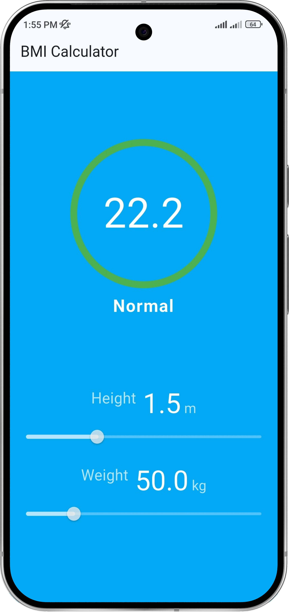
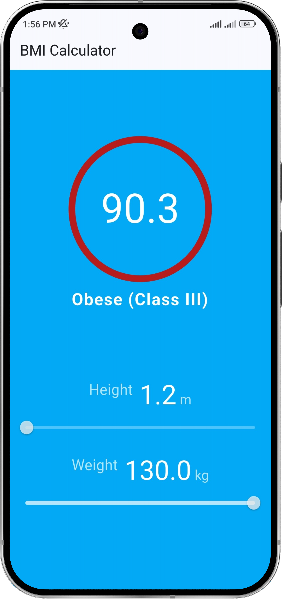

# BMI Calculator

A simple and responsive Flutter application that calculates the Body Mass Index (BMI) using height and weight inputs.  
This project demonstrates the use of **Provider state management**, **ChangeNotifier**, and **Consumer widgets**, along with clean architecture, reusable components, and real-time reactive UI updates.

<br>

## Screenshots

<div align="center">




</div>

> All screenshots are stored inside the `assets/screenshots/` directory and linked directly for GitHub preview.

<br>

## Features

- Real-time BMI calculation and automatic color update
- Provider-based state management using `ChangeNotifier`
- AutoSizeText for dynamic text scaling on various screen sizes
- Animated circular result display for smooth UI feedback
- Clean separation between logic and presentation layers
- Follows professional Git commit structure and documentation standards

<br>

## Folder Structure

```
bmi-calculator/
├── lib/
│   ├── main.dart
│   ├── bmi_home.dart
│   ├── constants.dart
│   ├── provider/
│   │    └── bmi_provider.dart
│   └── widgets/
│        ├── bmi_slider.dart
│        └── bmi_result.dart
│
├── assets/
│   └── screenshots/
│       ├── Screenshot_1.png
│       ├── Screenshot_2.png
│
├── pubspec.yaml
├── README.md
└── LICENSE
```

> - The core logic resides in `provider/bmi_provider.dart` using the ChangeNotifier pattern.
> - All UI components are modularized under the `widgets/` directory.

<br>

## Dependencies

```yaml
dependencies:
  flutter:
    sdk: flutter
  provider: ^6.1.2
  auto_size_text: ^3.0.0
```

> The **Provider** package manages app state efficiently, while **AutoSizeText** ensures responsive text rendering across different screen resolutions.

<br>

## BMI Formula

```
BMI = weight (kg) / (height (m) * height (m))
```

| BMI Range | Category |
|------------|-----------|
| < 16.0 | Underweight (Severe Thinness) |
| 16.0 – 16.9 | Underweight (Moderate Thinness) |
| 17.0 – 18.4 | Underweight (Mild Thinness) |
| 18.5 – 24.9 | Normal |
| 25.0 – 29.9 | Overweight (Pre-obese) |
| 30.0 – 34.9 | Obese (Class I) |
| 35.0 – 39.9 | Obese (Class II) |
| ≥ 40.0 | Obese (Class III) |

<br>

## Getting Started

### 1. Clone Repository
```bash
git clone https://github.com/arrahman10/bmi-calculator.git
cd bmi-calculator
```

### 2. Install Dependencies
```bash
flutter pub get
```

### 3. Run Application
```bash
flutter run
```

> Ensure Flutter SDK and Dart are properly configured in your system environment.

<br>

## Development Notes

- **Project Type:** Flutter mobile app (single-screen reactive layout)
- **Architecture:** Logic handled via Provider (ChangeNotifier + Consumer)
- **State Management:** Centralized with `BmiProvider`
- **UI Widgets:**
    - `BmiSlider` – For selecting height and weight values
    - `BmiResult` – Displays animated circular BMI result and status text
- **Animation:** Implemented via `AnimatedContainer`
- **Text Handling:** AutoSizeText ensures responsive typography
- **Testing:** Manually tested on Android device for different BMI ranges
- **Environment:**
    - Flutter SDK: ≥ 3.22
    - Dart SDK: ^3.9.2
    - App Version: 2.0.0+2
    - Publish Status: Private (`publish_to: none`)
- **Editor:** Developed and tested using Android Studio (Windows 11)
- **Git Workflow:** Semantic commit prefixes used — `feat:`, `refactor:`, `style:`, `docs:`

<br>

## License

This project is licensed under a **Personal and Educational Use Only License**.  
Commercial or business use is strictly prohibited without prior written consent.  
See the full [LICENSE](LICENSE) file for more details.

<br>

## Author

**Abdur Rahman**  
B.Sc. in Computer Science & Engineering, Leading University (Sylhet)  
GitHub: [@arrahman10](https://github.com/arrahman10)

---

> *This project is part of my Flutter learning journey and demonstrates professional coding, documentation, and version control practices.*
````
